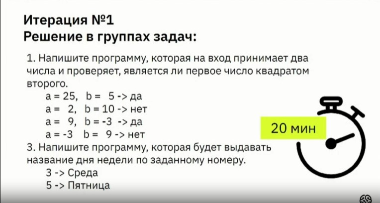

### 
Решить задание

### 
Решение задачи 2

Console.WriteLine("введите число первое");
int number1 = Convert.ToInt32(Console.RedLine());

Console.WriteLine("введите число второе");
int number2 = Convert.ToInt32(Console.RedLine());

if (number1/number2 == number2)
{
 Console.WriteLine("да");
}

else
{
   Console.WriteLine("нет");
}
